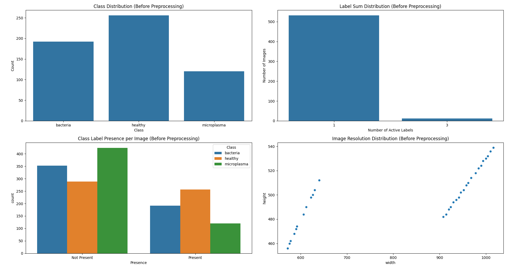
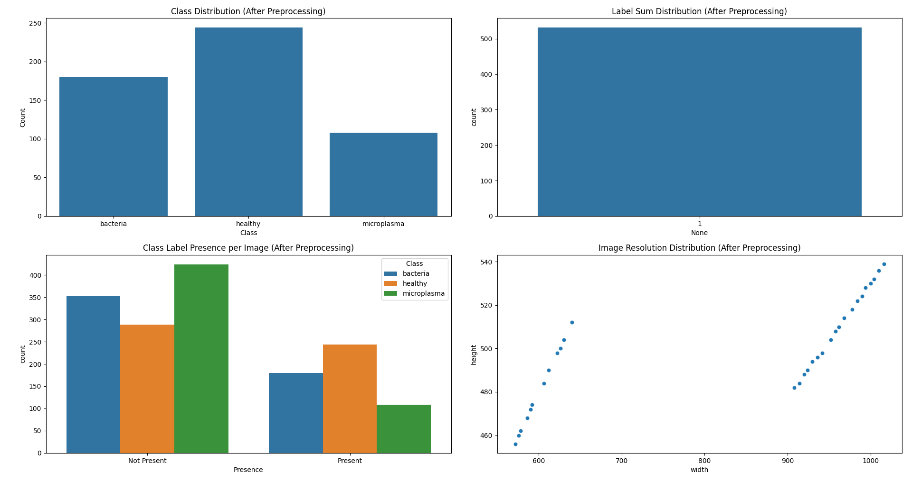

# Stem Cell Image Classification with Explainable Deep Learning

A complete deep learning pipeline for microscopy-based stem cell image classification, combining transfer learning, 
robust evaluation, and model explainability to ensure reliable and interpretable predictions.

This project focuses on building a reproducible and scientifically grounded deep learning workflow
for identifying contamination patterns in stem cell cultures.

---

# Project Overview

Stem cell culture environments are highly sensitive to contamination. Early identification of 
bacterial and microplasma contamination is critical for maintaining reliable biological experiments.

This project implements a deep learning–based classification system that categorizes microscopy images into three classes:

- Healthy stem cell cultures
- Bacterial contamination
- Microplasma contamination

Beyond classification performance, this work emphasizes model interpretability, 
ensuring that predictions are based on biologically meaningful image regions rather than dataset artifacts.

---

# Key Features

- End-to-end machine learning pipeline
- Data validation and preprocessing
- Stratified dataset splitting
- Transfer learning using EfficientNet-B0
- Modular PyTorch implementation
- Comprehensive evaluation metrics
- Grad-CAM based model interpretability
- Reproducible and well-structured codebase

---

# Dataset and Preprocessing

## Dataset Structure
The dataset consists of microscopy images with labels indicating contamination type.
The dataset is not included in this repository due to potential licensing and ownership considerations.  
However, the project expects the dataset to follow the structure described below.

### Directory Structure
<p align="center">
  
</p>


### CSV File Format

Each CSV file contains the image filename and the corresponding class labels.

Example:

| filename     | bacteria | healthy | microplasma |
|--------------|----------|---------|-------------|
| img_001.png  | 0        | 1       | 0           |
| img_002.png  | 1        | 0       | 0           |
| img_003.png  | 0        | 0       | 1           |

### Label Definition

Each image belongs to **exactly one class**, represented using one-hot encoding:

- `bacteria = 1` → bacterial contamination
- `healthy = 1` → healthy stem cell culture
- `microplasma = 1` → microplasma contamination

Only one label is active per row, ensuring a single-label classification setup.

### Notes

- All images should be stored in the `images/` directory.
- The `filename` column must correspond exactly to the image file names.
- The preprocessing scripts included in this repository validate that each sample has **exactly one active label** before training.

## Data Cleaning

Before training, the dataset was validated to ensure:

- No samples contained multiple labels
- Image paths were valid
- Class distribution remained balanced
- The label-sum distribution was verified to confirm that each image had exactly one active class label.

<p align="center">
  
<span style="display:inline-block; width:20px;"></span>
  
</p>

<p align="center">
  <em>
    Left: Dataset before cleaning.  
    Right: Dataset after cleaning.
  </em>
</p>

Invalid samples were removed to maintain label integrity.

## Dataset Split

A stratified split was used to maintain consistent class distribution across datasets.

| Split      | Percentage |
|------------|------------|
| Training   | 70%        |
| Validation | 15%        |
| Test       | 15%        |

Stratification prevents class imbalance from influencing model evaluation.

---

# Exploratory Data Analysis

EDA was performed prior to preprocessing to understand dataset characteristics:

- Class distribution analysis
- Label integrity verification
- Image resolution distribution
- Presence of labeling anomalies

These analyses ensured the dataset was suitable for supervised learning.

---

# Model Architecture

The model uses EfficientNet-B0, a convolutional neural network designed to achieve high performance while maintaining 
computational efficiency. EfficientNet scales network depth, width, and resolution in a balanced manner using a compound 
scaling strategy, allowing it to achieve strong performance with fewer parameters compared to traditional CNN architectures.

This architecture was originally proposed by Tan and Le (2019) [1].


EfficientNet-B0 was chosen for this project because:

- It provides strong feature extraction capabilities through pretrained ImageNet representations
- It performs well on small to medium-sized datasets, making it suitable for this microscopy dataset
- It offers a good balance between accuracy and computational cost
- Its architecture captures fine-grained visual patterns, 
which is important for identifying subtle morphological differences in stem cell images

## Transfer Learning Strategy

EfficientNet was initialized with ImageNet pretrained weights to leverage previously learned low-level and mid-level 
visual features.

Training was performed in Phase 1:

- Backbone frozen
- Only the classifier head trained
- Prevents overfitting on small datasets
- Allows the model to adapt pretrained representations to the stem cell classification task

Classifier head:

```
Dropout(0.5)
Linear(in_features → 3 classes)
```

---

# Training Strategy

Training was implemented in PyTorch with the following configuration:

- Loss Function: Cross Entropy Loss
- Optimizer: Adam Optimizer
- Learning Rate: 0.0001
- Batch Size: 16
- Epochs: 20

The best model was selected based on validation accuracy.

<p align="center">
  
  <em>
    Left: Training vs Validation Loss.  
    Right: Training vs Validation Accuracy.
  </em>
</p>


---

# Evaluation Metrics

The model was evaluated on a held-out **test set** using:

- Accuracy
- Precision
- Recall
- F1 Score
- Confusion Matrix

## Test Results

| Metric         | Score |
|----------------|-------|
| Accuracy       | 1.00  |
| Macro F1 Score | 1.00  |

Class-wise results showed perfect separation across the three categories.

<p align="center">
  
</p>
<p align="center">
  <em>
    Confusion matrix for test set.
  </em>
</p>

---

# Model Explainability (Grad-CAM)

To ensure the model learned biologically meaningful patterns, Grad-CAM was used to visualize the regions influencing 
predictions.

Grad-CAM highlights areas of the image that contributed most strongly to the classification decision.

## Observed Behavior

**Healthy Samples**

<p align="center">
  
</p>
<p align="center">
  <em>
    Observation: Distributed attention across consistent cellular textures.
  </em>
</p>

**Bacterial Contamination**

<p align="center">
  
</p>
<p align="center">
  <em>
    Observation: Localized hotspots corresponding to granular anomalies.
  </em>
</p>


**Microplasma Contamination**

<p align="center">
  
</p>
<p align="center">
  <em>
    Observation: Structured but more diffuse activation patterns indicating subtle morphological changes.
  </em>
</p>

These visualizations confirm that the model relies on cellular morphology rather than background artifacts.

---

# Example Grad-CAM Results

| Healthy                            | Bacteria                    | Microplasma                    |
|------------------------------------|-----------------------------|--------------------------------|
| Model focuses on global morphology | Localized anomaly detection | Structured regional activation |

These patterns align with expected biological characteristics of each class.

---

# Project Structure

<p align="center">
  
</p>


---

# Reproducibility

To reproduce the experiments:

1. Install dependencies:

```
pip install -r requirements.txt
```

2. Download the split dataset or download the entire dataset and preprocess using the following command:
   - If the dataset is already provided with predefined splits (`train.csv`, `val.csv`, `test.csv`), you may proceed directly 
   to Step 4.
   - Otherwise, download the full dataset and run the preprocessing script to clean and validate the data:

```
python preprocess.py
```

3. Split it using the following command:

```
python split_dataset.py
```


4. Train the model:

```
python train.py
```

5. Evaluate the model:

```
python test_evaluation.py
```

6. Generate Grad-CAM visualizations:

```
python gradcam.py
```

### Note:
If the model is to be trained using a GPU, download the appropriate CUDA toolkit version that corresponds to the 
PyTorch version that is being used and run the setup for it. This training uses:
- PyTorch version:  2.7.1 
- CUDA toolkit version 11.8.0

You can find more information in the official PyTorch website regarding compatible PyTorch and CUDA toolkit versions.
- Official PyTorch website: https://pytorch.org
- NVIDIA toolkit archive: https://developer.nvidia.com/cuda-toolkit-archive

Without this, the model will not be trained using GPU.

---

# Key Takeaways

This project demonstrates how deep learning can be applied to biomedical imaging problems with emphasis on:

- Data integrity
- Reproducible pipelines
- Transfer learning
- Model interpretability

Such practices are essential when deploying AI systems in scientific and medical fields.

---

# Future Work

Potential extensions include:

- K-fold cross validation
- Phase 2 fine-tuning of backbone layers
- Larger multi-laboratory datasets
- Integration with automated microscopy systems

---

# Technologies Used

- Python
- PyTorch
- Torchvision
- NumPy
- Pandas
- Scikit-learn
- OpenCV
- Matplotlib
- Seaborn

---

[1] Tan, M., & Le, Q. V. (2019).  
**EfficientNet: Rethinking Model Scaling for Convolutional Neural Networks.**  
ICML 2019.  
https://arxiv.org/abs/1905.11946

---

# Author
**Raghav Sarangan**

Computer Science Engineering  
Machine Learning • Computer Vision • Artificial Intelligence